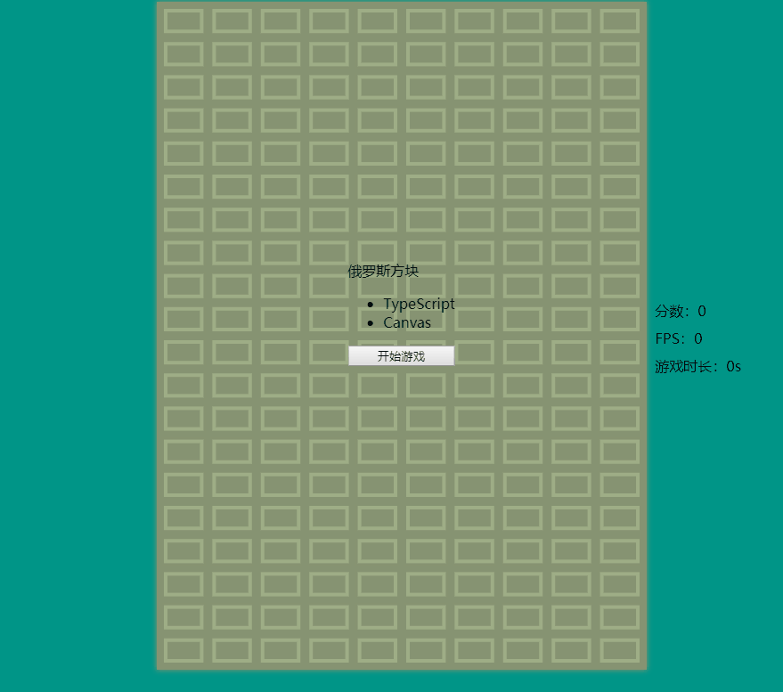

## 俄罗斯方块
Typescript + Canvas  [游戏预览](https://ddztomcat.github.io/eluosi/)

### 初衷
最近在看typescript，感觉跟java有点像，面向对象编程的感觉更强烈，于是就瞎写一通，canvas相关知识参考[html5 canvas核心技术]()

### 实现思路
+ 整个游戏主要就是一个canvas元素，首先将整个游戏抽象成方块矩阵，用一个二维数组表示`squareArr[][]`，每个数组元素是一个方块`square`，记录其位置`square.x，square.y，square.bold（是否加深颜色 1 0）`
+ 每一个下落的元素看作是由四个方块组成的，（不管什么形状都是四个），因此抽象成一个4*4的方块矩阵用`type[][]`表示
+ 好处是判断碰撞的时候只需要遍历`squareArr 和 type`只要方块bold = 1的数目大于4即碰撞，还有下落元素的旋转可以用`type[][] 矩阵转置来做`

### 具体效果

### todos
+ [ ] 游戏背景音乐
+ [ ] 下落元素提示
+ [ ] 事件出发优化
### changelog
+ 增加移动端操作按钮 2019.2.26
+ 改成rem 增加core-js 垫片 2019.3.5